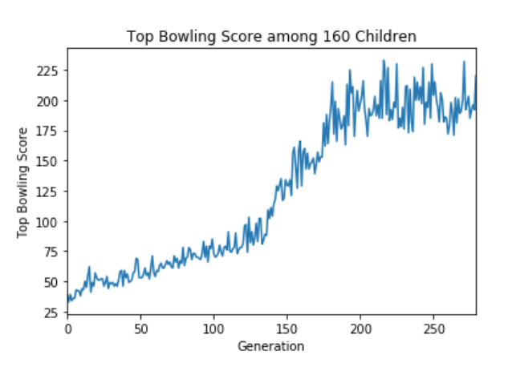
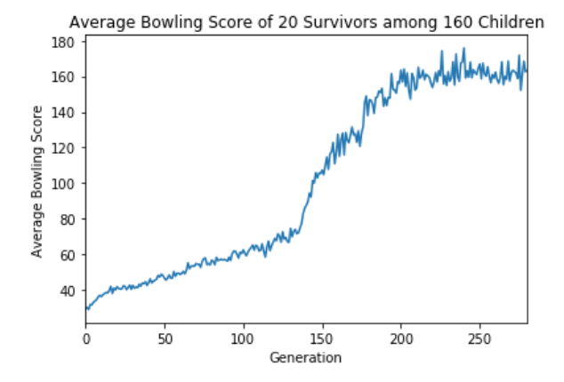

# gym_practice

This repo is for the final project of Artificial Intelligence class.

## How to run

*cartpole-random.py* runs the toy environment of cartpole. *simpleGA.py* is the main file of our project that runs the environment of Bowling (based on its Atari counterpart). It uses a simple Genetic Algorithm to achieve results that are on par with human's, and it's much faster than training in a neural network.

## Helpful Links
* Deep Reinforcement Learning: Pong from Pixels by Andrej Karpathy  http://karpathy.github.io/2016/05/31/rl/

* Introduction to reinforcement learning and OpenAI Gym    https://www.oreilly.com/learning/introduction-to-reinforcement-learning-and-openai-gym

* gym documents  https://gym.openai.com/docs/
## Performance
Here are the performance of my Genetic Algorithm in the Bowling environment:
Average Scores of Survivors in 280 Generations:

Top Scores in 280 Generations:

The average Bowling score of 20 survivors reaches a plateau after about 200 generations, and the score fluctuates around 160. In comparison, the average score of a human gamer scores around 154.8, and the score from DQN by Google DeepMind is only 42.4 (± 88). (See "Human-level control through deep reinforcement learning”, https://www.nature.com/articles/nature14236.)

It takes a few hours on my Macbook Pro (Early 2015 version, 8GB RAM, 2.7 GHz Intel Core i5 CPU) to train, which is much shorter than Policy Gradient or Deep-Q learning.

## TODO lists
* More experiments with Genetic Algorithm on different Gym environment
